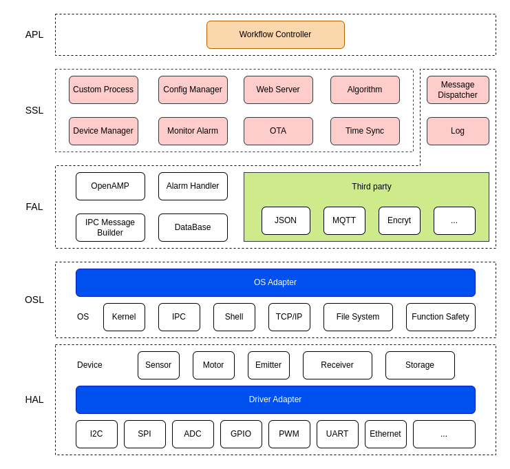

# OpenEmber 嵌入式分布式通信中间件软件

**OpenEmber** 是一个面向常见智能设备的嵌入式应用软件开发框架，目前仅支持 Linux 操作系统。核心使用 C/C++ 编写，采用 Kconfig + CMake + FetchContent 构建系统。和 ROS2 类似，OpenEmber 也是分布式架构，节点模型可通过“发布-订阅（pub/sub）”机制进行消息通信。

OpenEmber 框架包含设备端应用程序常见的模块，包括消息通信、设备管理、数据采集、协议解析、状态监控、配置管理、日志记录、远程升级、图形界面等功能模块。模块之间采用消息通信机制进行同步，天生支持分布式部署，也就是说，功能模块可以部署在不同的硬件平台（包括异构多核平台）。

## 项目起源

我们曾经用 Linux 系统做过许多嵌入式/物联网项目，包括工业控制设备、通信终端、数据采集仪、高精传感器、物联网、车联网等。在多次重复开发之后，觉得有必要将一些通用的功能模块抽象出来，方便大家复用，加速开发更多有趣的项目。因此，我们创建了 OpenEmber 项目。

OpenEmber 项目默认实现了 Linux 系统监控功能，可通过 Web 查看系统状态。

## 框架结构

```bash
┌──────────────────────────────────────────────┐
│                  Applications                │
│──────────────────────────────────────────────│
│ launch / demos / tools / robot nodes / apps  │
└──────────────────────────────────────────────┘
                     │
                     ▼
┌──────────────────────────────────────────────┐
│                    Modules                   │
│──────────────────────────────────────────────│
│ 插件层（功能扩展层，可裁剪，可选启用）             │
│                                              │
│ transport backends:  nng / zmq / lcm         │
│ drivers:             imu / lidar / motor     │
│ algorithms:          slam / navigation       │
│ middleware adaptors: fastdds / ros bridge    │
└──────────────────────────────────────────────┘
                     │
                     ▼
┌──────────────────────────────────────────────┐
│                  Components                  │
│──────────────────────────────────────────────│
│ 基础设施组件层（跨模块复用能力）                  │
│                                              │
│ logging                                      │
│ serialization                                │
│ container (ringbuffer / queue)               │
│ database (sqlite wrapper)                    │
│ transport abstraction                        │
│ config parser                                │
└──────────────────────────────────────────────┘
                     │
                     ▼
┌──────────────────────────────────────────────┐
│                     Core                     │
│──────────────────────────────────────────────│
│ 框架运行核心机制（middleware runtime）          │
│                                              │
│ node lifecycle                               │
│ executor scheduler                           │
│ topic manager                                │
│ parameter system                             │
│ service framework                            │
└──────────────────────────────────────────────┘
                     │
                     ▼
┌──────────────────────────────────────────────┐
│                   Platform                   │
│──────────────────────────────────────────────│
│ OS abstraction + HAL abstraction             │
│                                              │
│ platform/os                                  │
│   thread / mutex / timer / socket            │
│                                              │
│ platform/hal                                 │
│   uart / spi / can / gpio / i2c              │
└──────────────────────────────────────────────┘
                     │
                     ▼
┌──────────────────────────────────────────────┐
│                Operating System              │
│──────────────────────────────────────────────│
│  Linux / RTOS / Windows / macOS（未来支持）    │
└──────────────────────────────────────────────┘
```




## 设计思想

1. 一个仓库以 **现代 C++ 为主线**实现核心能力，并通过稳定的 **C ABI 边界**提供“有针对性的 C 支持”（例如 MISRA 受限场景的接入模板）。

   API 兼容等问题通过本仓库的工程结构和工具链设计来解决，例如顶层的 CMake 设计（仅示意）：
   ```bash
   option(OPENEMBER_ENABLE_CPP        "Enable C++ runtime" ON)
   option(OPENEMBER_ENABLE_C_ADAPTER "Enable C ABI adapter" OFF)
   ```

   当用户选择 “C 接入模板” 时，通信骨架/transport 等能力只允许选择 **C 可直接链接**的实现（例如 NNG/LCM/libzmq 的 C 侧接口），避免维护“双主线同构实现”的复杂度。

2. 支持三种开发方式：

   1. 用户可以直接 clone 本仓库，添加自己的功能模块，但后续升级 OpenEmber 框架比较麻烦；
   2. 使用脚手架工具 `ember new` 生成干净的 OpenEmber 工程，用户直接在该模板工程上进行开发；
   3. 直接生成 OpenEmber 的库文件，并安装到系统，用户后续可以直接通过 CMake 引用 OpenEmber 库，然后单独开发和维护自己的模块/节点代码。

3. 依赖库管理：支持 **FetchContent / Vendor / System** 三种模式（通过 `OPENEMBER_THIRD_PARTY_MODE` 控制），以便固定版本、可下载、可升级。

   - `FETCH`：构建时下载固定版本到构建目录
   - `VENDOR`：使用仓库内 `third_party/` 的已落库版本
   - `SYSTEM`：优先使用系统已安装依赖（Yocto/企业场景）

4. 通过插件化设计，实现底层依赖库的切换，例如支持 pub-sub 的通信骨架，底层可能是 ZeroMQ、LCM 或 NNG，需要保证 API 不变，通过配置改变底层调用。


### 目录结构

```bash
openember/
│
├── apps/
│   ├── launch/
│   ├── demos/
│   └── tools/
│
├── modules/
│   ├── transport/
│   │   ├── nng/
│   │   ├── zmq/
│   │   └── lcm/
│   │
│   ├── drivers/
│   │   ├── imu/
│   │   ├── lidar/
│   │   └── motor/
│   │
│   └── algorithms/
│
├── components/
│   ├── logging/
│   ├── container/
│   ├── database/
│   ├── serialization/
│   └── transport/
│
├── core/
│   ├── runtime/
│   ├── executor/
│   ├── node/
│   ├── topic/
│   └── parameter/
│
├── platform/
│   ├── os/
│   │   └── linux/
│   │
│   └── hal/
│       ├── uart/
│       ├── spi/
│       ├── can/
│       └── gpio/
│
├── third_party/
├── vendor/
├── configs/
└── tools/
```

OpenEmber v0.1 就采用：

- Fetch 默认
- Vendor 可选
- System 可选
- Transport 插件化
- 核心层零依赖

这会让项目一开始就具备工业级气质。


## 模块功能

| 模块名称 | 简介         | 说明                                                         |
| -------- | ------------ | ------------------------------------------------------------ |
| Log      | 日志服务系统 | 抽象日志输入接口，实现日志的统一管理，包括定时冲刷、自动滚动、磁盘管理等。 |
| OTA      | 远程升级     | 包括在线升级、离线升级、状态脚本等功能                       |
| MSG      | 消息服务     | 支持 DBus、MQTT、ZeroMQ、rabbitMQ、DDS 等底层消息服务        |
|          |              |                                                              |
|          |              |                                                              |


## 通信方式

- 高频数据：iceoryx
- 节点控制通信：ZeroMQ / LCM / NNG
- 其他：RPC
- 统一抽象层


## 开发计划

See [TODO](TODO.md)


## 应用案例

OpenEmber 适用于需要长期运行的智能设备，这些设备通常有这些特点：7×24 运行，有状态、有配置，模块长期在线，需要远程运维，升级、监控、日志比“算得快”更重要。例如无人值守终端（洗衣 / 充电 / 储物）、工业网关（Modbus / CAN / OPC UA 聚合）等。

下面是一些客户案例：

- 工业设备控制器
- 轮式/腿足式机器人
- 智能传感器（激光雷达）
- 边缘 AI 设备
- 智能咖啡机
- 智能家居控制器
- 环保数采仪
- 自助洗车机
- 食堂自动称重计费控制器
- 智能聊天机器人
- 智能垃圾回收机

另外，OpenEmber 可作为 ROS 的“硬件隔离层”，ROS 通过 OpenEmber 的通信模块拿数据、控制硬件。
