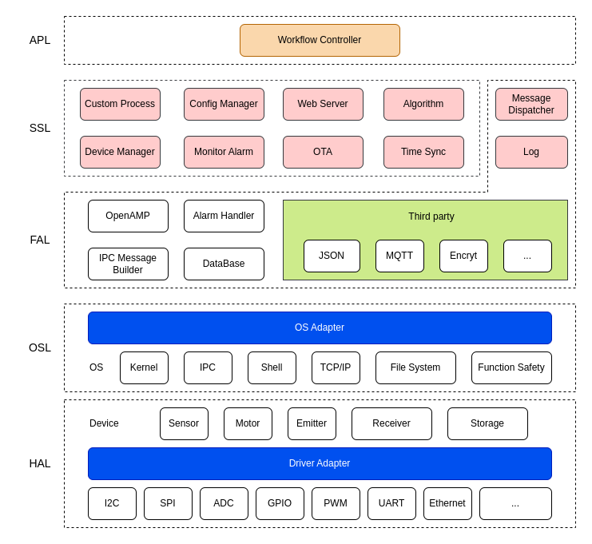

# OpenEmber

**OpenEmber** 是一个专用于嵌入式 Linux 系统的应用程序开发框架，它也是 [OpenEmber Core 规范](docs/core/README.md) 的标准 C 实现，另一个 C++ 实现是 [OpenEmber-Plus](https://github.com/openember/openember-plus)。

OpenEmber 框架包含设备端应用程序常见的模块，包括消息通信、设备管理、数据采集、协议解析、状态监控、配置管理、日志记录、远程升级、图形界面等功能模块。模块之间采用消息通信机制进行同步，天生支持分布式部署，也就是说，功能模块可以部署在不同的硬件平台（包括异构多核平台）。

## 项目起源

我们曾经用 Linux 系统做过许多嵌入式/物联网项目，包括工业控制设备、通信终端、数据采集仪、高精传感器、物联网、车联网等。在多次重复开发之后，觉得有必要将一些通用的功能模块抽象出来，方便大家复用，加速开发更多有趣的项目。因此，我们创建了 OpenEmber 项目。

OpenEmber 项目默认实现了 Linux 系统监控功能，可通过 Web 查看系统状态。

## 框架结构

## 模块功能

| 模块名称 | 简介         | 说明                                                         |
| -------- | ------------ | ------------------------------------------------------------ |
| Log      | 日志服务系统 | 抽象日志输入接口，实现日志的统一管理，包括定时冲刷、自动滚动、磁盘管理等。 |
| OTA      | 远程升级     | 包括在线升级、离线升级、状态脚本等功能                       |
| MSG      | 消息服务     | 支持 DBus、MQTT、ZeroMQ、rabbitMQ、DDS 等底层消息服务        |
|          |              |                                                              |
|          |              |                                                              |

## 开发计划

See [TODO](TODO.md)

## 应用案例

OpenEmber 适用于需要长期运行的智能设备，这些设备通常有这些特点：7×24 运行，有状态、有配置，模块长期在线，需要远程运维，升级、监控、日志比“算得快”更重要。例如无人值守终端（洗衣 / 充电 / 储物）、工业网关（Modbus / CAN / OPC UA 聚合）等。

下面是一些客户案例：

- [智能咖啡机](#)
- [温室控制器](#)
- [环保数采仪](#)
- [自助洗车机](#)
- [食堂称重计费终端](#)
- [激光雷达](https://github.com/luhuadong/LidarApp)
- [智能聊天机器人](#)

另外，OpenEmber 可作为 ROS 的“硬件隔离层”，ROS 通过 OpenEmber 的通信模块拿数据、控制硬件。
